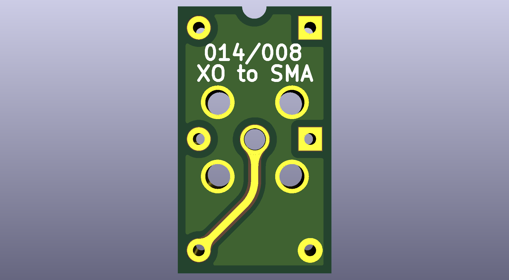
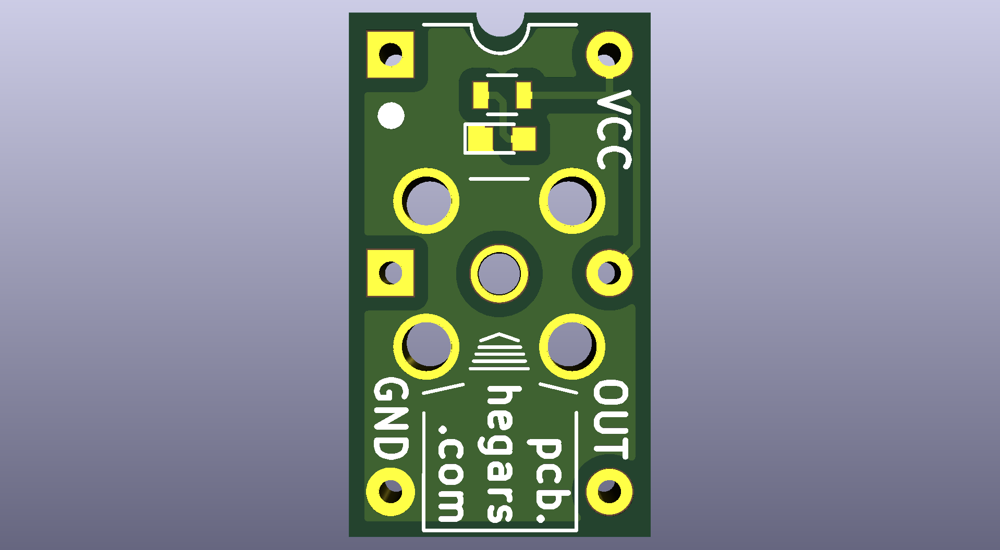
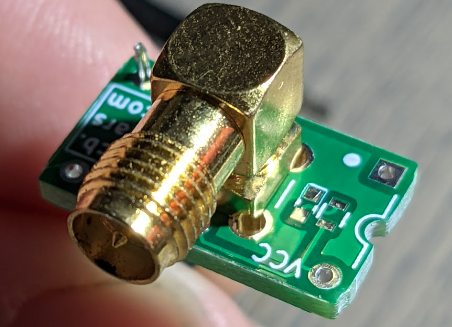
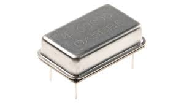

# 14DIPxSMA
 This is a 14 or 8 Pin DIP adaptor to SMA for XO use with external XO.

## Use Case
This modules allows for the interface of and external clock generation using something like Si5351A

## RF tools for KiCAD
https://github.com/easyw/RF-tools-KiCAD
